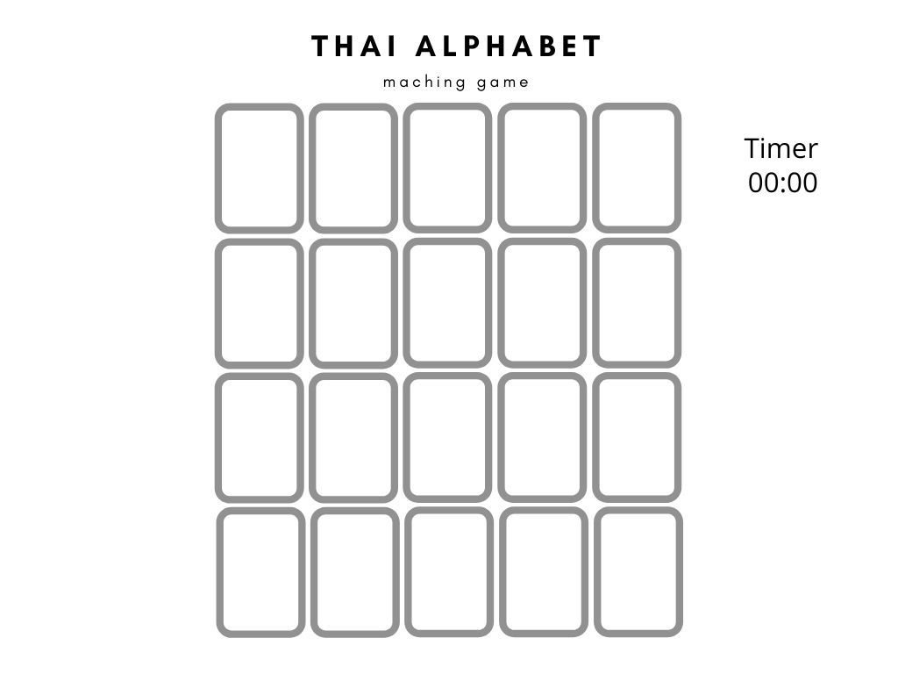
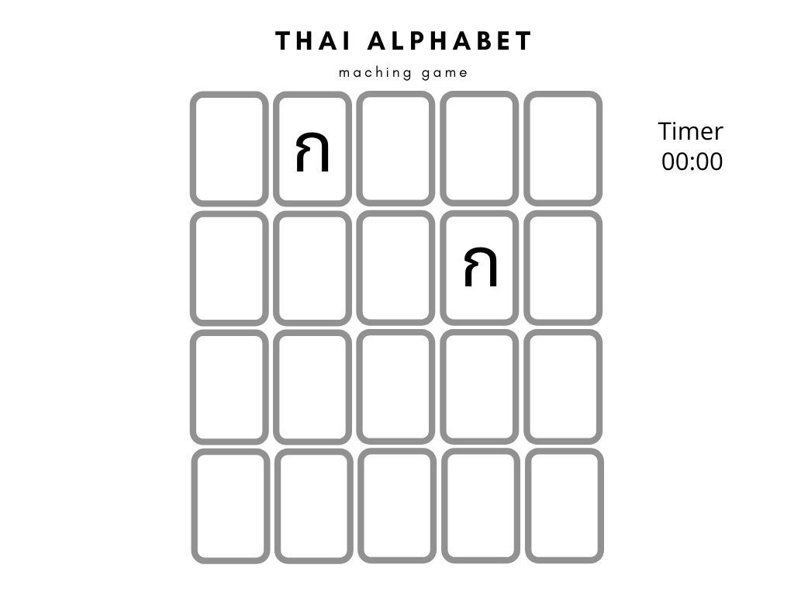

 ## Project Description
 My game is call Thai Alphabet Matching Game. It's a game app for players who want to learn Thai and want to memorizing Thai alphabets. The game will have 20 cards and there are 10 pairs of Thai alphabet with picture of the word that begin with that alphabet. Player need to click on a card, then another. If they match, they'll show the cards. If they don't match, they'll flip back over. Player need to match all 10 pairs to win the game

 - Click "play" to start the game.

- Play the game by "click" a card then another to matching a pair.

- When the cards matched it will stay opened.

- When the cards match all 10 pairs you win! and unlog to sing alphabet song.

- You can sing along with the song and learn Thai alphabet. Also if you want to play again you can! 

## Built With
- [HTML](#html)
- [CSS](#css)
- [JavaScript](#javascript)

## Installation instructions

- Clone the repo
`git clone https://github.com/your_username_/Thai-Matching-Game`

## User stories

- As a player, I would like to see all the random 20 cards.
- As a player, I would like to be able to click the cards for matching 10 pairs.
- As a player, I would like to see after click if the card if there are match or don't match.
- As a player, I would like to see the pair of cards flip back over if there are don't match.
- As a player, I would like to see I win the game after I matched all 10 pairs.
- As a player I would like to be able to restart the game after a win.

## Wireframes

 ## Descriptions of any Unsolved problems or major hurdles you had to overcome

 - At first I have a hard time to create function but after I finished my first function another one it's getting better same as the CSS after the first page I work on it fastter and more comfortable  
 - I still have a hard time to do Top10 rank
